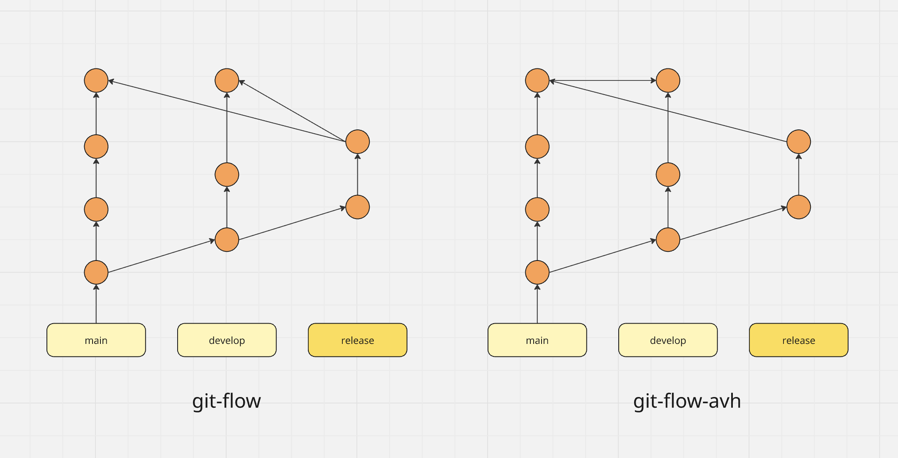

When git-flow was first <a href="https://nvie.com/posts/a-successful-git-branching-model/" target="_blank" rel="noopener noreferrer">introduced by Vincent Driessen in 2010</a>, it revolutionized the way developers managed their Git workflows. The model provided a structured approach to branching and merging, offering a clear path for feature development, releases, and hotfixes.

Git-flow quickly gained popularity among development teams, providing a much-needed framework for organizing complex projects and collaborating effectively. Its well-defined branch structure and release management system brought order to what was often a chaotic development landscape.

However, as with any tool or methodology, time and experience revealed areas for improvement. Developers began to encounter limitations and inefficiencies in the original git-flow model, particularly in modern, fast-paced development environments.

Enter <a href="https://github.com/petervanderdoes/gitflow-avh" target="_blank" rel="noopener noreferrer">git-flow-avh</a>, an enhanced version of the original git-flow. Created by Peter van der Does, this alternative implementation addresses many of the pain points of the original model while maintaining its core principles. The "AVH" portion of the name comes from "A VirtualHome", since Peter van der Does' blog is hosted at <a href="http://blog.avirtualhome.com" target="_blank" rel="noopener noreferrer">http://blog.avirtualhome.com</a>.

Git-flow-avh offers improved flexibility, better release management, and enhanced configurability, making it a more suitable choice for today's diverse development needs.

In this blog post, we'll explore why git-flow-avh has emerged as a superior alternative to the original git-flow, examining its key advantages and how it resolves common workflow challenges.

Whether you're a long-time git-flow user or new to structured Git workflows, understanding the benefits of git-flow-avh can help you optimize your development process and improve team collaboration.

## A Quick Word on Compatibility

Git-flow-avh maintains compatibility with the original git-flow model, ensuring that teams familiar with git-flow can easily transition.

If you're already familiar with the original git-flow model, you'll feel right at home.

You have nothing to lose and everything to gain, as the added improvements tackle common workflow challenges and provide greater flexibility, making it a more suitable choice for various development scenarios.

All right, enough with the hype. Let's take a closer look at the improvements made and familiarize ourselves with the advantages of the git-flow-avh model!

## Key Advantages of git-flow-avh

While git-flow provided a solid foundation for managing Git workflows, git-flow-avh builds upon this foundation with several key improvements. These enhancements address common pain points and offer greater flexibility, making it a more robust solution for modern development teams.

Let's explore the primary advantages of git-flow-avh over the original git-flow:

### 1. Improved Release Merging Strategy

One of the most significant improvements in git-flow-avh is its approach to merging release branches.

In the original git-flow model, release branches are merged separately into both `main` and `develop` branches. This can lead to a complex history and potential inconsistencies.

Git-flow-avh adopts a more streamlined approach by merging the release branch to `main` first, then merging `main` back into `develop`.

This strategy creates a linear, unified history that's easier to follow and understand. It ensures that the `develop` branch always contains everything in `main`, reducing the risk of lost changes or inconsistencies between branches.

This is arguably the most important distinction between the two models. The ability to create releases directly from any branch (like develop) without requiring a dedicated release branch offers several significant advantages:

- **Reduced Ceremony**: Eliminates the overhead of creating, managing, and closing a separate `release` branch when it’s not needed.
- **Faster Releases**: Shortens the release process by removing steps, particularly valuable for frequent or small releases.
- **Direct Path to Production**: Provides a more direct path from development to production when appropriate.
- **Reduced Cognitive Load**: Fewer branches to track and manage when not needed

### 2. Flexible Release Creation

Git-flow-avh also offers more flexibility in how releases are created and managed.

Git-flow requires dedicated release branches for every release, which can be overkill for smaller projects or frequent releases.

Git-flow-avh, on the other hand, allows creating releases directly from any branch, including `develop`. For example, you can use `git flow release develop` to merge `develop` to `main` and tag it as a release.

This flexibility enables simpler workflows and adapts better to various project sizes and release frequencies. You can use traditional release branches for major releases while using direct releases for minor updates

### 3. Enhanced Hooks Support

Git hooks are powerful tools for automating processes around Git commands, and git-flow-avh improves their implementation.

Git-flow-avh offers improved implementation and support for Git hooks throughout the workflow, allowing for better integration with CI/CD systems and custom scripts at various stages of the workflow.

The flexibility of git-flow-avh essentially gives teams the best of both worlds: the structured approach of the traditional git-flow model when needed, combined with the simplicity of direct deployments when appropriate.

Thanks to Git hooks, teams can automate more processes, enforce standards, and integrate with other tools more effectively.

### 4. Extensive Configurability

As we've seen previously, git-flow-avh recognizes that one size doesn't fit all when it comes to Git workflows, offering more configuration options.

This is why git-flow-avh provides more configuration options for branch naming and workflow preferences.

These options include:
- Custom branch prefixes beyond the standard `feature`/`release`/`hotfix`
- Version tag prefixes (e.g., 'v1.0.0')
- Branch-specific configurations

These additional configuration options allow teams to adapt the workflow to their specific preferences and project requirements more easily. It provides the structure of git-flow with the flexibility to customize where needed.

## Final Words

With its improved release merging strategy, flexible release creation, enhanced hooks support, and extensive configurability, git-flow-avh provides a more adaptable and efficient approach to managing Git workflows.

For teams currently using git-flow, transitioning to git-flow-avh offers a path to optimize processes without a drastic change in methodology. git-flow-avh strikes an excellent balance between structure and flexibility.

As you consider refining your Git workflow, we encourage you to explore git-flow-avh as a compelling choice for modern software development teams.
